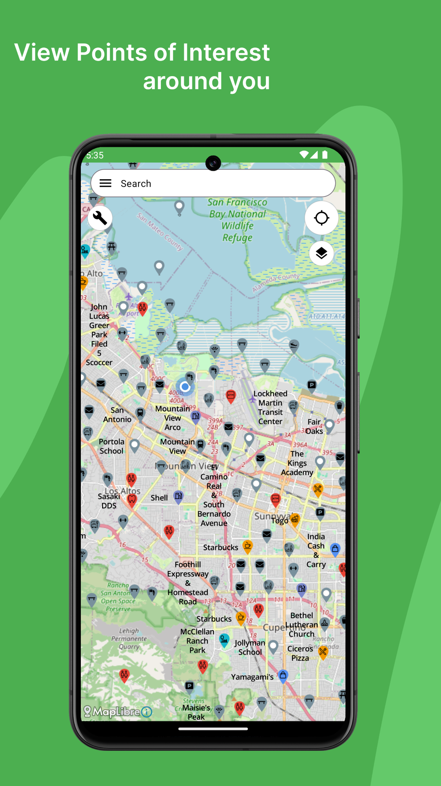
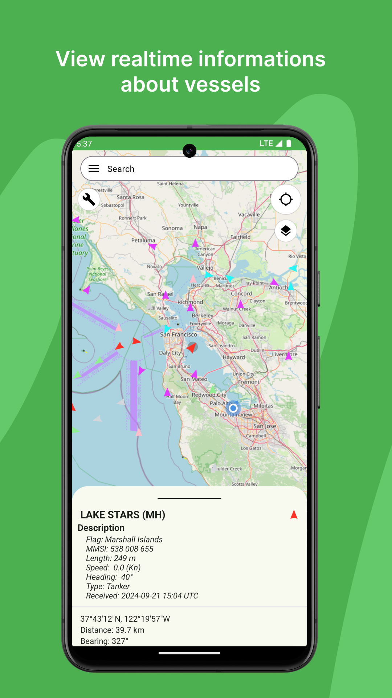
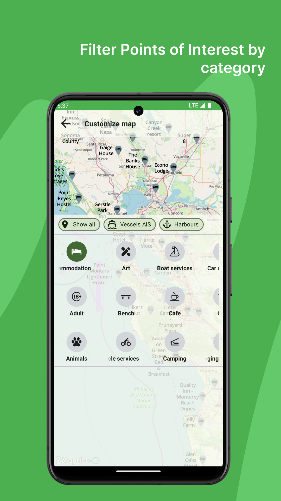
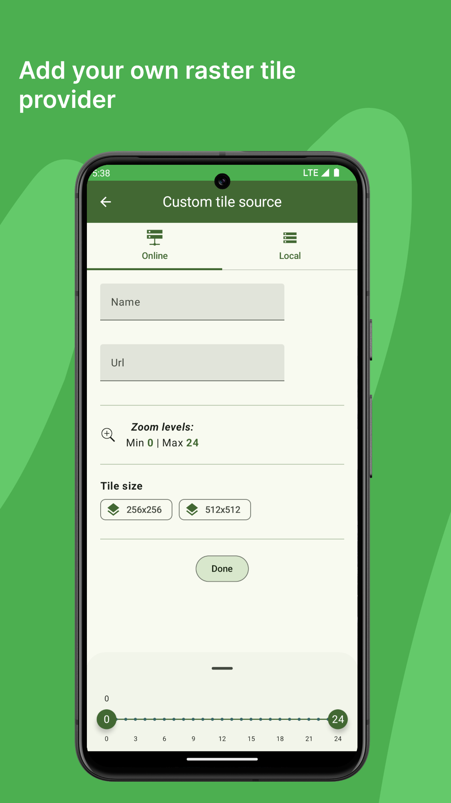
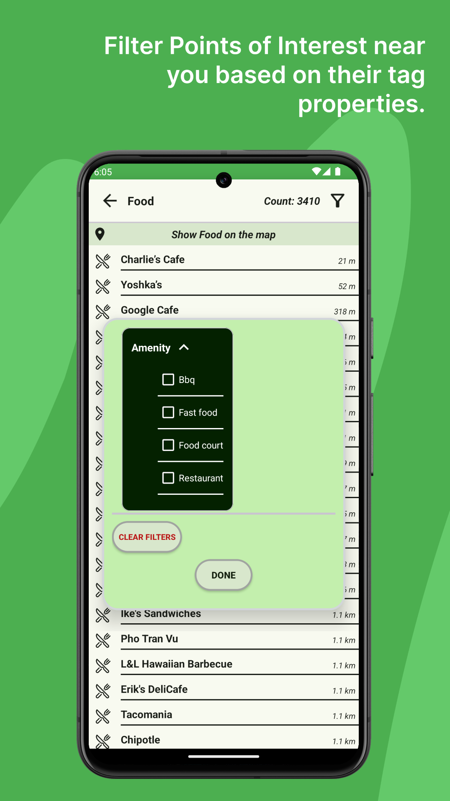

# NautiChart

## Overview
NautiChart is an application designed to provide users with real-time vessel positions, harbours and marinas locations, as well as points of interest. Leveraging data fetched from MarineTraffic API, Overpass API, and Nominatim for address and place searching.

**_Please note that NautiChart is still in development, so some features are not implemented yet._**

    

## Features
- **Vessel Tracking**: Latest positions of vessels worldwide.
- **Harbour and Marina Information**: View positions of harbours and marinas.
- **Points of Interest**: Discover various points of interest around you that are part of Open Source OpenStreetMap database.
- **Search Functionality**: Easily search for addresses and other places using Nominatim integration.

## Technologies Used
- **Kotlin, [Coroutines](https://developer.android.com/kotlin/coroutines) & [Flow](https://developer.android.com/kotlin/flow)**
- **MarineTraffic API**: Provides real-time vessel positions and other maritime data.
- **Overpass API**: Fetches points of interest around the user's location.
- **Nominatim**: Used for searching addresses and places.
- **Room**: Persistence library for storing app data.
- **Jetpack DataStore**: Data storage solution from the Android Jetpack libraries.
- **JSoup**: Library for parsing HTML.
- **Retrofit**: A type-safe HTTP client for Android and Java.
- **AppSearch API**: For advanced search capabilities.
- **Gson**: Library for JSON serialization and deserialization.
- **Dagger Hilt**: Dependency injection framework.
- **Coil**: An image loading library for Android and Compose Multiplatform.

## License
**NautiChart** is licensed under the **GNU General Public License (GPL)**. This license ensures that anyone who distributes copies of your app, whether for free or for a fee, must also make the source code available under the same license. This effectively prevents others from selling your app without also providing the source code.

## Note
**NautiChart** is a passion project developed with the aim of learning and exploring Android development. Please note that while the app provides valuable functionalities, it may contain certain aspects that are not optimized for professional use. As the developer, I had limited experience in Android development when starting this project, which may reflect in some hard-to-understand or non-scalable parts of the application. Your understanding and feedback are appreciated as I continue to improve and refine the app over time.

## Contact
mikailodev@gmail.com
